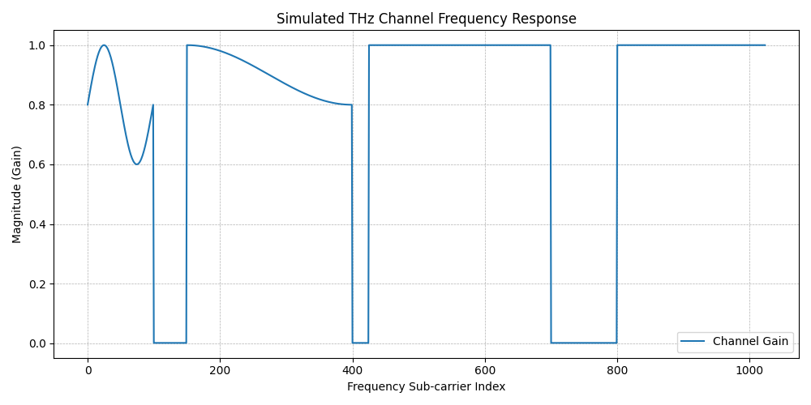
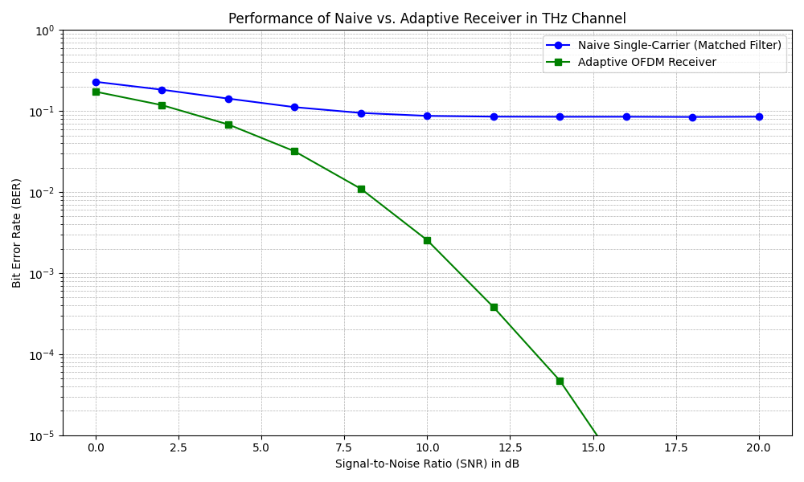

# THz Communication: Adaptive OFDM vs. Naive Receiver Simulation


This repository contains a Python simulation for a course project (ECC-507) at IIT Roorkee. The project models and analyzes the performance of a communication system operating in the Terahertz (THz) band.

The core idea is to compare a **naive single-carrier (matched filter) receiver** against an **adaptive OFDM receiver** in a channel impaired by severe frequency-selective molecular absorption.

## 💡 Key Concept

The THz band promises massive, terabit-per-second bandwidths, but signals suffer from **molecular absorption** (e.g., from water vapor). This phenomenon creates deep "dips" or "nulls" in the channel's frequency response, effectively erasing parts of the signal.

This simulation demonstrates *why* a simple receiver fails in this environment and *how* an adaptive, channel-aware receiver (like OFDM) is essential for viable THz communication.

---

## 🚀 How to Run

1.  **Clone the repository:**
    ```bash
    git clone [https://github.com/alexaryan7/ECC-507-Project.git]
    cd [ECC-507-Project]
    ```

2.  **Install dependencies:**
    The project only requires `numpy` and `matplotlib`.
    ```bash
    pip install numpy matplotlib
    ```

3.  **Run the simulation:**
    ```bash
    python thz_simulation.py
    ```

The script will:
* Print the simulation progress (SNR and BER) to the console.
* Save two plots, `thz_channel_response.png` and `thz_ber_comparison.png`, in the root directory.

---

## 📈 Results and Discussion

The simulation clearly validates the project's hypothesis.

### 1. The Simulated THz Channel

This plot shows our modeled channel, which simulates the transmission "windows" (gain $\approx$ 1) and the deep absorption "dips" (gain $\approx$ 0) characteristic of the THz band.



### 2. BER Performance Comparison

This is the key result of the project. It plots the Bit Error Rate (BER) against the Signal-to-Noise Ratio (SNR).



**Discussion:**

* **Naive Receiver (Blue Line):** This receiver's performance is extremely poor. It hits an **"error floor"** at around 8.5%. This means that even with infinite signal power (high SNR), the error rate never improves. The errors are dominated by the channel's absorption dips, not by random noise.

* **Adaptive OFDM Receiver (Green Line):** This "optimal" receiver's performance is vastly superior. By intelligently identifying and **avoiding the "dead" subcarriers**, it completely bypasses the error floor. Its performance is limited only by random noise, which can be overcome with higher SNR.

---

## 📁 Repository Contents

* `thz_simulation.py`: The main Python simulation script.
* `report.tex` / `report.pdf`: The 2-page IEEE-formatted LaTeX report.
* `thz_channel_response.png`: Output plot of the channel model.
* `thz_ber_comparison.png`: Output plot of the BER comparison.
* `README.md`: This file.

---

## 👤 Author & Course

* **Author:** Aryan Raj
* **Enrollment:** 22116021
* **Institute:** Dept. of Electronics and Communication Engg., IIT Roorkee
* **Course:** ECC-507

## 📄 License

This project is licensed under the MIT License.
